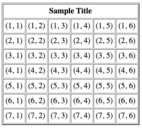

# SwiftWebUI

# Table of Contents
1. [Introduction](#introduction)
2. [The Sample Code](#the-sample-code)
3. [The Problem](#the-problem)
4. [The Proposal](#the-proposal)

## Introduction
This is not a fully functioning UI framework, and does not intend to be. This is meant to be a demonstration of how an opinionated web UI framework can be built on top of my other recent project, [Vaux](https://github.com/dokun1/Vaux). I want to encourage you to read this and either tear this approach to pieces, or get inspired to make your own framework to do this!

## The Sample Code

Rather than use Vaux directly, we can use the example in this library to write a table like so:

```swift
import SwiftWebUI

class SomeClass: TableDataSource {
  init() { 
    createTable()
  }
  
  func createTable() {
    let table = SwiftWebUI.Table()
    table.datasource = self
    table.numberOfRows = 7
    table.numberOfColumns = 7
    table.filename = "table"
    table.fileLocation = "/tmp/"
    table.headerTitle = "Sample Title"
    do {
      try table.render()
    } catch let error {
      print(error.localizedDescription)
    }
  }
  
  func valueForIndex(row: Int, column: Int) -> HTML? {
    return "(\(row), \(column))"
  }
}
```

This will create a file called `table.html` in your `/tmp/` directory. When loaded in a web browser, it looks like this:



The HTML code for this file looks like so, and is completely generated at runtime by `SwiftWebUI`, using `Vaux` under the hood:

```markup
<!DOCTYPE html>
<html>
  <body>
    <table cellpadding="4" cellspacing="1" border="2">
      <th colspan="7" scope="colgroup">
        Sample Title
      </th>
      <tr>
        <td align="center">
          (1, 1)
        </td>
        <td align="center">
          (1, 2)
        </td>
        <td align="center">
          (1, 3)
        </td>
        <td align="center">
          (1, 4)
        </td>
        <td align="center">
          (1, 5)
        </td>
        <td align="center">
          (1, 6)
        </td>
      </tr>
      <tr>
        <td align="center">
          (2, 1)
        </td>
        <td align="center">
          (2, 2)
        </td>
        <td align="center">
          (2, 3)
        </td>
        <td align="center">
          (2, 4)
        </td>
        <td align="center">
          (2, 5)
        </td>
        <td align="center">
          (2, 6)
        </td>
      </tr>
      <tr>
        <td align="center">
          (3, 1)
        </td>
        <td align="center">
          (3, 2)
        </td>
        <td align="center">
          (3, 3)
        </td>
        <td align="center">
          (3, 4)
        </td>
        <td align="center">
          (3, 5)
        </td>
        <td align="center">
          (3, 6)
        </td>
      </tr>
      <tr>
        <td align="center">
          (4, 1)
        </td>
        <td align="center">
          (4, 2)
        </td>
        <td align="center">
          (4, 3)
        </td>
        <td align="center">
          (4, 4)
        </td>
        <td align="center">
          (4, 5)
        </td>
        <td align="center">
          (4, 6)
        </td>
      </tr>
      <tr>
        <td align="center">
          (5, 1)
        </td>
        <td align="center">
          (5, 2)
        </td>
        <td align="center">
          (5, 3)
        </td>
        <td align="center">
          (5, 4)
        </td>
        <td align="center">
          (5, 5)
        </td>
        <td align="center">
          (5, 6)
        </td>
      </tr>
      <tr>
        <td align="center">
          (6, 1)
        </td>
        <td align="center">
          (6, 2)
        </td>
        <td align="center">
          (6, 3)
        </td>
        <td align="center">
          (6, 4)
        </td>
        <td align="center">
          (6, 5)
        </td>
        <td align="center">
          (6, 6)
        </td>
      </tr>
      <tr>
        <td align="center">
          (7, 1)
        </td>
        <td align="center">
          (7, 2)
        </td>
        <td align="center">
          (7, 3)
        </td>
        <td align="center">
          (7, 4)
        </td>
        <td align="center">
          (7, 5)
        </td>
        <td align="center">
          (7, 6)
        </td>
      </tr>
    </table>
  </body>
</html>
```

If you want to try this yourself, import this library into your own project, or clone this repo and open up `SwiftWebUITests.swift` and play with the unit test I've written for this example.

## The Problem

Thanks to Vaux and the [function builder](https://github.com/apple/swift-evolution/blob/3e6b78c0e7ddc60f88d2c126722e1a319d3b1749/proposals/XXXX-function-builders.md) capacity in Swift 5.1, you have the ability to write pure HTML using Swift functions. This is awesome functionality, but requires an understanding of HTML and its procedural nature. Given the above example, even with looping built into Vaux, this creates a main problem: Swift developers should not have to worry about interfacing directly with HTML. 

Thus, the goal of this repository is to **demonstrate that it is indeed possible to create an opinionated UI framework for the web that can generate HTML that is fully annotated for style and function**.

## The Proposal

I, David Okun, intend to keep maintaining Vaux as a functioning DSL library. Vaux should provide an intermediate level to writing HTML for Swift developers. I am hoping that others notice this and take action to work on such a framework. Some points:

1. **Vaux and other upcoming HTML DSLs are still works in progress**. While this is true, the entire DOM and all possible attributes are available through the `attr(key:value:)` and `custom(tag:child:)` functions in Vaux. As Vaux continues to grow, I hope that other libraries that take advantage of this functionality and move the needle for what Vaux needs to turn into.
2. **The API in this example repo is poorly built.** It probably is, and I am hoping that others take this as an opportunity to provide something more feature complete and functional to use. I built this API as a minimum example to demonstrate my manifesto for how DSLs in Swift can be used. Given all of the buzz around SwiftUI, it would make sense that its web counterpart also be functional and declarative - I have not yet fully grasped that model of programming, so I am hoping you, the reader, are that person!
3. **But will anyone use this?** That depends. Templating libraries, such as [Stencil](https://stencil.fuller.li/en/latest/) are heavily used today as a front end web solution right now, and not just for Swift. Given the popularity of Swift DSLs to HTML since the announcement of the feature, it will be awesome to see someone take this all the way and do something meaningful with it. I hope that person is you, reader!
4. **But isn't your full time job all about convincing people to use Swift on the server?** Sure it is, and I sure would love it if you tried [Kitura](https://kitura.io), but my goal here is to try and get the ecosystem moving for Swift on the web, and this works with Swift anywhere it can compile today - not just Kitura.

Thanks for reading this far, and I hope this has inspired you to get working on something! 

